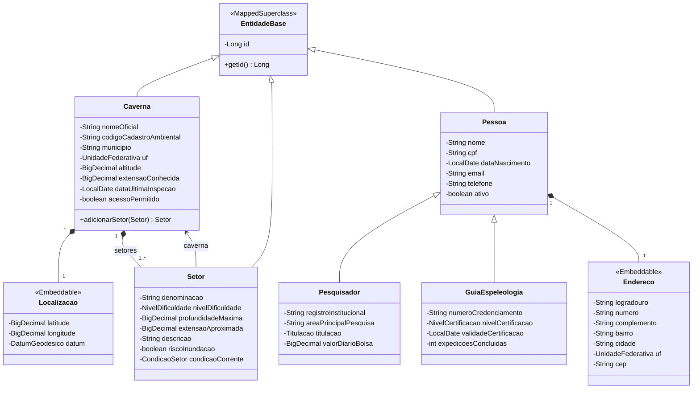

# UML inicial — parte de Victor

Planejamento para incorporação incremental a partir do setup, registrado antes das classes nesta branch. As classes abaixo representam o escopo planejado, não uma declaração de que todas já foram implementadas. O README informa o estado corrente.

Decisões herdadas da referência: identidade numérica gerada com IDENTITY; `Localizacao` e `Endereco` incorporados sem tabela própria; enumerações persistidas como STRING; `Setor` proprietário da FK `caverna_id`; cascata e orphanRemoval de Caverna para Setor; herança JOINED planejada para pessoas.

`Pessoa`, suas especializações e sua integração com Alan/Ícaro ficam para uma entrega posterior. O diagrama completo do domínio continua disponível em `docs/diagrama-classes.md` do setup. Este recorte não substitui o UML completo da entrega final.
