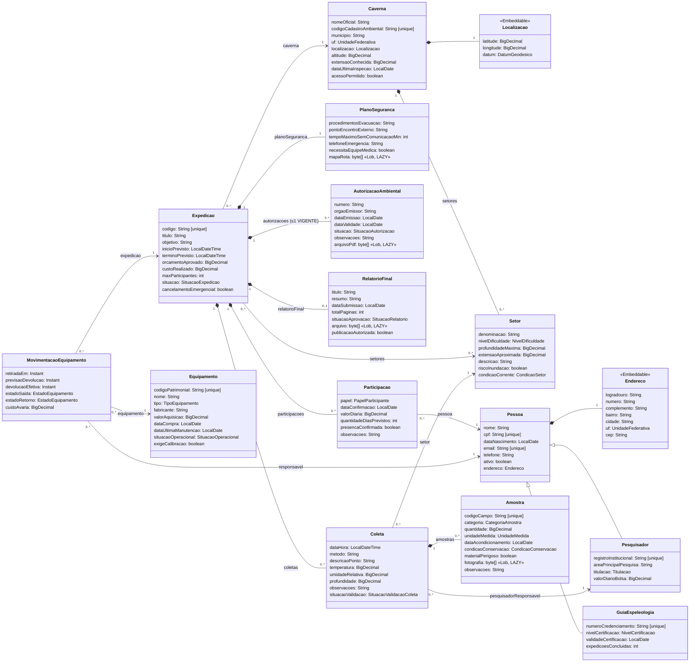

# Diagrama de classes — TurmalinaPB

Modelo completo do domínio, com as 14 entidades e os 2 tipos incorporáveis. Ele foi registrado neste
repositório antes da implementação das partes de Alan (planejamento) e Ícaro (operação e
resultados); o [README](../README.md) informa o que já está implementado. O recorte inicial dos
cadastros, anterior às classes de Victor, está em [diagrama-cadastros.md](diagrama-cadastros.md).

Diagrama em Mermaid; o GitHub e o VS Code (com extensão de Mermaid) o renderizam direto.
Enumerações aparecem como tipos dos atributos e estão listadas ao final.
`id: Long` (herdado de `EntidadeBase`, `@MappedSuperclass` com identidade IDENTITY) foi omitido das
classes para reduzir o ruído. `[unique]` marca unicidade de uma coluna; as compostas estão ao final.

## Enumerações

| Enum | Valores |
|---|---|
| SituacaoExpedicao | PLANEJADA, AUTORIZADA, EM_ANDAMENTO, CONCLUIDA, CANCELADA |
| NivelDificuldade | BAIXO, MODERADO, ALTO, EXTREMO |
| CondicaoSetor | LIBERADO, RESTRITO, INTERDITADO, EM_AVALIACAO |
| TipoEquipamento | ILUMINACAO, CORDA_E_ANCORAGEM, PROTECAO_INDIVIDUAL, COMUNICACAO, NAVEGACAO_E_TOPOGRAFIA, MEDICAO_AMBIENTAL, COLETA_DE_AMOSTRAS, PRIMEIROS_SOCORROS, FOTOGRAFIA, OUTRO |
| SituacaoOperacional | DISPONIVEL, EM_USO, EM_MANUTENCAO, AGUARDANDO_CALIBRACAO, BAIXADO |
| EstadoEquipamento | NOVO, BOM, REGULAR, DANIFICADO, INUTILIZAVEL |
| PapelParticipante | COORDENADOR, PESQUISADOR, GUIA, APOIO_TECNICO, SOCORRISTA, FOTOGRAFO, ESTUDANTE |
| CategoriaAmostra | ROCHA, MINERAL, SEDIMENTO, SOLO, AGUA, FAUNA, FLORA, FUNGO, MICROBIOLOGICA, PALEONTOLOGICA, ARQUEOLOGICA |
| CondicaoConservacao | INTEGRA, PARCIALMENTE_DEGRADADA, DEGRADADA, CONTAMINADA |
| UnidadeMedida | MILIGRAMA, GRAMA, QUILOGRAMA, MICROLITRO, MILILITRO, LITRO |
| SituacaoValidacaoColeta | PENDENTE, VALIDADA, REJEITADA |
| SituacaoAutorizacao | EM_ANALISE, VIGENTE, VENCIDA, REVOGADA, INDEFERIDA |
| SituacaoRelatorio | RASCUNHO, SUBMETIDO, EM_REVISAO, APROVADO, REPROVADO |
| Titulacao | GRADUACAO, ESPECIALIZACAO, MESTRADO, DOUTORADO, POS_DOUTORADO |
| NivelCertificacao | BASICO, INTERMEDIARIO, AVANCADO, INSTRUTOR |
| DatumGeodesico | SIRGAS_2000, WGS_84, SAD_69, CORREGO_ALEGRE |
| UnidadeFederativa | 27 siglas |

## Unicidades compostas e regras no banco

| Tabela | Colunas únicas em conjunto | Regra do domínio |
|---|---|---|
| setor | caverna_id, denominacao | Dois setores da mesma caverna não têm o mesmo nome |
| participacao | expedicao_id, pessoa_id | A mesma pessoa não participa duas vezes da mesma expedição |
| autorizacao_ambiental | orgao_emissor, numero | O número da autorização é único por órgão emissor |
| expedicao | plano_seguranca_id; relatorio_final_id | Plano e relatório pertencem a uma única expedição (1:1) |

No máximo uma autorização `VIGENTE` por expedição: índice único parcial criado pelo script
`META-INF/sql/pos-criacao.sql`, executado na criação do esquema.

> Observação: Expedicao → Setor está como `0..*` porque a expedição pode ser planejada antes da
> definição dos setores. Os setores precisam pertencer à caverna da expedição; essa regra é
> verificada em `Expedicao.abrangerSetor`.
